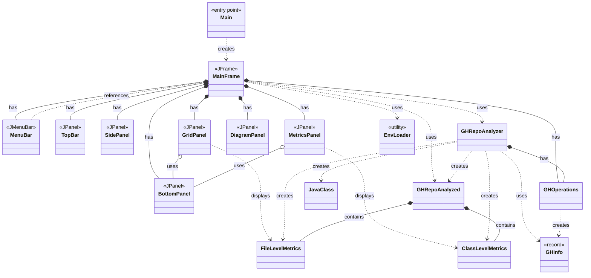

# GitHub Repository Analyzer

A Java application that analyzes GH repos to:
- display **project directory tree**
- calculate **file level metrics**: 
   - size
   - complexity
- calculate **class level metrics**:
   - abstractness 
   - instability 
   - distance
- generate **UML class diagrams**

## How to Run

1. Set your GitHub token in `.env`:
   ```
   GITHUB_TOKEN=your_token_here
   ```

2. Compile and run:
   ```bash
   mvn clean compile
   mvn exec:java -Dexec.mainClass="Asgn3.Main"
   ```

3. On GUI: enter a GH repository URL (must point to a `/src` directory)

4. View results in the Grid, Metrics, and Diagram tabs

5. Additional features included in menu bar: 
   - file 
      - open from URL: analyze a new repo (has same functionality as 'ok' button next to where you insert a GH repo)
      - exit: close application 
   - action
      - reload: re-analyze current repo
      - clear: clear all results and reset application 
   - help
      - about: application info

---
# CLASS DIAGRAM 

**[UML Diagram](https://www.mermaidchart.com/d/6e540e71-043a-4e22-beee-6400c3d738fe)**
OR 
**Can be found in:** src/main/resources/Class-Diagram.png

**Mermaid Code:**



---

# SAMPLE TESTER GH URL 

**[GH](https://github.com/meganfung38/sample/tree/main/src)**
